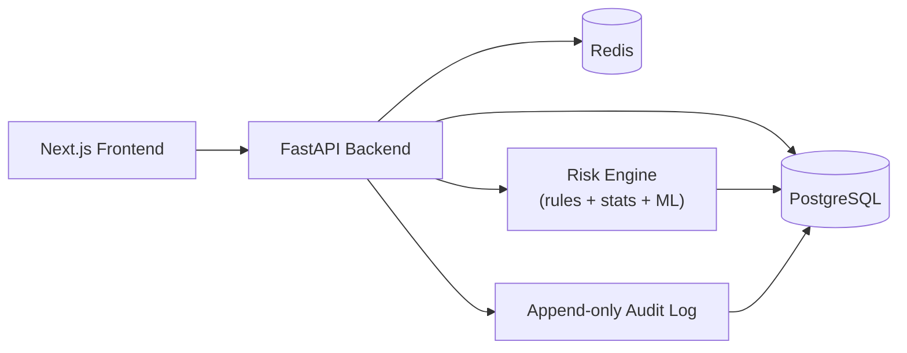

<div align="center">

# MPLADS Sentinel

**AI-powered anomaly, fraud & inefficiency detection for the MPLAD Scheme**

Built for **Smart India Hackathon 2026** · Problem Statement **26102** · MoSPI, Data Informatics & Innovation Division

[](#)
[](#)
[](#)
[](#license)

[Overview](#overview) · [Core Capabilities](#core-capabilities) · [Architecture](#architecture-at-a-glance) · [Getting Started](#getting-started) · [Documentation](#documentation)

</div>

---

## Overview

MPLADS involves large-scale fund utilization across thousands of MPs, districts, and implementing agencies — with manual audits sampling only a small fraction of works. **MPLADS Sentinel** continuously scores every project against known fraud and inefficiency patterns — cost inflation, payment-progress mismatches, duplicate works, stalled execution, contractor concentration risk — and surfaces the ones that need human attention, evidence attached.

It is **not** an analytics dashboard bolted onto an AI label. It is a decision-support and case-management system built around one loop, repeated for every project in the system:

<div align="center">

**`flag`** → **`explain`** → **`investigate`** → **`decide`** → **`record`**

</div>

Every risk score decomposes into named, weighted, human-readable reasons. Every alert has a lifecycle ending in a recorded, auditable decision — never a silent number on a dashboard.

```
RISK SCORE: 87 / 100 — CRITICAL

Reasons:
• Financial:  Sanctioned cost is 31% above the median for comparable
              "road construction" works in this state this year
• Payment:    ₹18L (62% of sanctioned cost) released while reported
              physical progress stood at 15%
• Duplicate:  A work with 89% description similarity exists 1.4 km
              away, sanctioned 3 months earlier
• Timeline:   No progress update in 214 days against an expected
              duration of 180 days
```

## Core capabilities

| Pillar | What it does | Who uses it |
|---|---|---|
| 🧠 **Risk & Anomaly Detection Engine** | 8 hybrid rule / statistical / ML detectors compute an explainable 0–100 risk score per project, with every subscore traceable to specific evidence | Runs continuously; consumed by every role |
| 📊 **Project & Compliance Monitoring** | Role-scoped dashboards, project timelines, fund-utilization trends, geographic risk heatmap | Ministry / State / District officers, MP viewers |
| 🔍 **Investigation Workspace** | Alert → Case lifecycle with an evidence panel, related-project graph, contractor history, and an immutable audit trail | Auditors / Investigation Officers |

One shared data model, three lenses on it — not three unrelated mini-apps.

> Full product spec, PRD, ER diagrams, wireframes, security model, and phased build plan live in [`MPLADS-Sentinel-SIH2026-Blueprint.md`](./MPLADS-Sentinel-SIH2026-Blueprint.md).

## Architecture at a glance



- **Detection is hybrid, not black-box** — rules (payment/progress thresholds), statistics (peer-group cost benchmarking), and unsupervised ML (Isolation Forest, LOF, TF-IDF similarity, contractor graph analysis) each target a *specific* named failure mode, and each one's output doubles as its own explanation.
- **Modular monolith**, not microservices — right-sized for a hackathon prototype and easy to reason about.
- **Zero mandatory external API dependency** — runs fully self-contained on seeded/synthetic data, so a live demo can't break on a third-party outage.

## Tech stack

| Layer | Choice |
|---|---|
| Frontend | Next.js 14 (App Router) · TypeScript · Tailwind CSS · Recharts · Leaflet (OpenStreetMap, no API key) |
| Backend | Python · FastAPI (modular monolith) · SQLAlchemy · Alembic |
| Data | PostgreSQL · Redis (cache + job queue) |
| ML | scikit-learn (Isolation Forest, LOF, TF-IDF) · NetworkX (contractor graph analysis) |
| Auth | JWT (access + refresh) · server-side RBAC (role + geography scope) |

## Project structure

```
.
├── frontend/                      # Next.js app
│   ├── app/                       # routes: dashboard, projects, alerts, cases, admin, ...
│   ├── components/
│   │   ├── ui/                    # design-system primitives
│   │   ├── risk/                  # RiskBadge, RiskBar, SignalExplanation
│   │   ├── charts/                # Recharts wrappers
│   │   └── map/                   # Leaflet wrapper, cluster layer
│   └── lib/                       # api-client, auth, rbac
├── backend/                        # FastAPI app
│   ├── app/
│   │   ├── api/routes/             # projects, alerts, cases, admin, auth
│   │   ├── core/                   # config, security, rbac
│   │   ├── models/                 # SQLAlchemy models
│   │   ├── schemas/                # Pydantic schemas
│   │   ├── services/
│   │   │   ├── ingestion/          # CSV/JSON loaders + quarantine handling
│   │   │   ├── audit/              # append-only audit writer
│   │   │   └── notification/       # in-app notifications
│   │   └── risk_engine/            # detectors D1-D8 + aggregator (framework-agnostic)
│   └── tests/
├── docker-compose.yml
├── .env.example
└── MPLADS-Sentinel-SIH2026-Blueprint.md   # full PRD / architecture / demo doc
```

## Getting started

### Prerequisites
- Docker & Docker Compose
- Node.js 20+ (for local frontend dev outside Docker)
- Python 3.11+ (for local backend dev outside Docker)

### Run locally

```bash
git clone https://github.com/<org>/mplads-sentinel.git
cd mplads-sentinel
cp .env.example .env

# Start Postgres, Redis, backend, frontend
docker compose up --build

# In a separate terminal: run migrations + seed synthetic data
# (seeds ~5-10k projects with known, documented anomaly patterns)
docker compose exec backend python -m scripts.seed
```

| Service | URL |
|---|---|
| Frontend | http://localhost:3000 |
| Backend API docs (Swagger) | http://localhost:8000/docs |

### Demo accounts

Seeded with one account per role — see `backend/scripts/seed.py` for credentials.

| Role | Scope | Purpose |
|---|---|---|
| Central Ministry Analyst | National | Cross-state oversight, systemic pattern detection |
| State Nodal Officer | State | State-level compliance monitoring |
| District Officer | District | Project execution, progress updates |
| MP / Constituency Viewer | Constituency | Read-only transparency into fund usage |
| Auditor / Investigation Officer | Assigned cases | Full evidence review and case resolution |
| System Administrator | System-wide | User management, ingestion health, model tuning |

### Environment variables

| Variable | Purpose |
|---|---|
| `DATABASE_URL` | Postgres connection string |
| `REDIS_URL` | Redis connection string |
| `JWT_SECRET` / `JWT_REFRESH_SECRET` | Token signing secrets |
| `ENV` | `dev` / `prod` |
| `CORS_ORIGINS` | Allowed frontend origin(s) |

See [`.env.example`](./.env.example) for the full list. No external API keys are required for core functionality.

## Testing

```bash
# Backend — unit + integration (risk_engine detectors are unit-tested
# against synthetic ground truth with known injected anomalies)
docker compose exec backend pytest

# Frontend — end-to-end
cd frontend && npm run test:e2e
```

## Roadmap

- [x] Product blueprint, ER model, architecture, and phased build plan
- [ ] Phase 1–3: Frontend/backend foundation, database & seed pipeline
- [ ] Phase 4: Risk engine (8 detectors + explainable aggregator)
- [ ] Phase 5: Alert & investigation workflow
- [ ] Phase 6–8: Integration, security hardening, full test suite
- [ ] Phase 9–10: Deployment, demo rehearsal

See [`MPLADS-Sentinel-SIH2026-Blueprint.md`](./MPLADS-Sentinel-SIH2026-Blueprint.md) Part 18 for the full phase-by-phase plan and Part 20 for per-phase implementation prompts.

## What this project deliberately does not include

No chatbot, no blockchain, no voice assistant, no microservices split, no unnecessary mobile app, and no external API as a hard dependency. Every feature maps to one of the three pillars above — see the blueprint's "What We Should Not Build" section for the full reasoning behind each exclusion.

## Documentation

- [`MPLADS-Sentinel-SIH2026-Blueprint.md`](./MPLADS-Sentinel-SIH2026-Blueprint.md) — full PRD, system architecture, AI/ML design, ER diagram, wireframes, API contracts, security model, phased build plan, and demo script.

## Contributing

This is a hackathon team project. If you're on the team:
1. Pick up a phase from the [Roadmap](#roadmap) / blueprint Part 18.
2. Branch from `main` as `phase-<n>-<short-description>`.
3. Open a PR referencing the relevant blueprint section.
4. Keep the "what we're not building" list in mind before adding scope.

## License

TBD — add your team's chosen license before submission.

---

<div align="center">

Built for **Smart India Hackathon 2026** · Problem Statement 26102 · MoSPI, Data Informatics & Innovation Division

</div>
