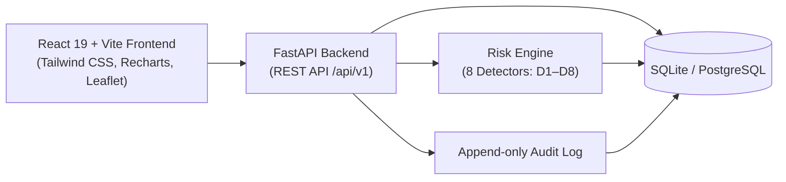

<div align="center">

# MPLADS Sentinel

**AI-powered anomaly, fraud & inefficiency detection for the MPLAD Scheme**

Built for **Smart India Hackathon 2026** · Problem Statement **26102** · MoSPI, Data Informatics & Innovation Division

[](#)
[](#)
[](#)
[](#license)

[Overview](#overview) · [Core Capabilities](#core-capabilities) · [Architecture](#architecture-at-a-glance) · [Getting Started](#getting-started) · [Demo Accounts](#demo-accounts) · [Risk Engine](#risk-engine-detectors)

</div>

---

## Overview

MPLADS involves large-scale fund utilization across thousands of MPs, districts, and implementing agencies — with manual audits sampling only a small fraction of works. **MPLADS Sentinel** continuously scores every project against known fraud and inefficiency patterns — cost inflation, payment-progress mismatches, duplicate works, stalled execution, contractor concentration risk — and surfaces the ones that need human attention, with clear evidence attached.

It is a decision-support and case-management system built around one loop:

<div align="center">

**`flag`** → **`explain`** → **`investigate`** → **`decide`** → **`record`**

</div>

Every risk score decomposes into named, weighted, human-readable reasons. Every alert has a lifecycle ending in a recorded, auditable decision — never a silent number on a dashboard.

```
RISK SCORE: 87 / 100 — CRITICAL

Reasons:
• Financial:  Sanctioned cost is 31% above the median for comparable
              "road construction" works in this state this year
• Payment:    ₹18L (62% of sanctioned cost) released while reported
              physical progress stood at 15%
• Duplicate:  A work with 89% description similarity exists 1.4 km
              away, sanctioned 3 months earlier
• Timeline:   No progress update in 214 days against an expected
              duration of 180 days
```

---

## Core Capabilities

| Pillar | What it does | Who uses it |
|---|---|---|
| 🧠 **Risk & Anomaly Detection Engine** | 8 hybrid rule / statistical / ML detectors compute an explainable 0–100 risk score per project, with every subscore traceable to specific evidence | Runs continuously; consumed by every role |
| 📊 **Project & Compliance Monitoring** | Role-scoped dashboards, project timelines, fund-utilization trends, geographic risk heatmap | Ministry / State / District officers, MP viewers |
| 🔍 **Investigation Workspace** | Alert → Case lifecycle with an evidence panel, related-project graph, contractor history, and an immutable audit trail | Auditors / Investigation Officers |

---

## Architecture at a glance



- **Detection is hybrid, not black-box** — rules (payment/progress thresholds), statistics (peer-group cost benchmarking), and unsupervised ML (Isolation Forest, LOF, TF-IDF similarity, contractor graph analysis) each target a *specific* named failure mode.
- **Modular architecture** — clean separation between frontend (`frontend/`) and backend (`backend/`).
- **Zero mandatory external API dependency** — runs fully self-contained on seeded/synthetic data with automated startup initialization.

---

## Tech Stack

| Layer | Choice |
|---|---|
| **Frontend** | React 19 · Vite · TypeScript · Tailwind CSS · Recharts · Leaflet · Lucide Icons |
| **Backend** | Python 3.11+ · FastAPI · SQLAlchemy · Pydantic v2 · Uvicorn |
| **Database** | SQLite (default dev) / PostgreSQL (production ready) |
| **ML & Analytics** | scikit-learn (Isolation Forest, LOF) · NetworkX · NumPy · SciPy · Faker |
| **Auth & Security** | JWT (access tokens) · Role-Based Access Control (RBAC) · Password hashing (bcrypt) |

---

## Project Structure

```
.
├── backend/                           # FastAPI Application
│   ├── app/
│   │   ├── api/routes/                # API Endpoints (admin, alerts, analytics, auth, cases, dashboard, map, projects, reports)
│   │   ├── core/                      # Config, security, RBAC definitions
│   │   ├── data/                      # e-Sakshi datasets
│   │   ├── db/                        # Database session & models base
│   │   ├── models/                    # SQLAlchemy database models
│   │   ├── risk_engine/               # 8 detectors (D1-D8) & aggregator
│   │   │   └── detectors/
│   │   ├── schemas/                   # Pydantic validation schemas
│   │   └── services/                  # Seed generator, audit logger, ingestion
│   ├── tests/                         # Pytest test suite (API & Risk Engine)
│   ├── Dockerfile
│   ├── main.py                        # FastAPI entrypoint & auto-seeding
│   └── requirements.txt
├── frontend/                          # React + Vite Application
│   ├── public/                        # Static icons & assets
│   ├── src/
│   │   ├── assets/
│   │   ├── components/                # Layout (Sidebar, TopBar), Risk widgets, UI cards
│   │   ├── context/                   # AuthContext
│   │   ├── lib/                       # Axios API client
│   │   ├── pages/                     # Dashboard, Projects, Alerts, Investigation, Map, Analytics, Reports, Admin, Login
│   │   ├── types/                     # TypeScript data contracts
│   │   ├── App.tsx
│   │   └── main.tsx
│   ├── Dockerfile
│   ├── package.json
│   └── vite.config.ts
├── docker-compose.yml
├── .env.example
├── .gitignore
└── README.md
```

---

## Risk Engine Detectors

| Code | Detector Name | Method | Failure Mode Detected |
|---|---|---|---|
| **D1** | Cost Benchmarking | Robust Z-Score / IQR | Work sanctioned significantly above peer median cost |
| **D2** | Payment-Progress Mismatch | Rule Threshold | High fund disbursement against minimal reported physical progress |
| **D3** | Duplicate Works | Geo-Distance + TF-IDF | Near-identical works sanctioned in same vicinity within short time |
| **D4** | Execution Staleness | Timeline Analysis | Long delays without physical or financial milestone updates |
| **D5** | Multivariate Outlier | Isolation Forest | Unusual combinations of cost, duration, agency load |
| **D6** | Local Density Outlier | Local Outlier Factor | Works deviating from local neighborhood distribution |
| **D7** | Contractor Graph Risk | NetworkX Graph Centrality | Contractor concentration, shell contractor or circular bidding patterns |
| **D8** | Approval Velocity | Distribution Anomaly | Abnormally rapid approvals bypassing statutory scrutiny |

---

## Getting Started

### Prerequisites
- **Node.js**: v20+
- **Python**: v3.11+
- (Optional) **Docker & Docker Compose**

---

### Option 1: Running Locally (Fastest)

#### 1. Backend Setup
```bash
cd backend
python -m pip install -r requirements.txt
uvicorn main:app --reload --host 0.0.0.0 --port 8000
```
> The backend automatically initializes and seeds SQLite database (`mplads.db`) on first startup.
> API Documentation is live at: `http://localhost:8000/docs`

#### 2. Frontend Setup
```bash
cd frontend
npm install
npm run dev
```
> Frontend is live at: `http://localhost:3000`

---

### Option 2: Running with Docker Compose

```bash
# Clone the repository
git clone https://github.com/himanshusah276/MPLADS-2.git
cd MPLADS-2

# Launch backend and frontend containers
docker compose up --build
```

---

## Demo Accounts

All demo accounts use the standard password: **`demo123`**

| Role | Email | Scope | Capabilities |
|---|---|---|---|
| **Central Ministry Analyst** | `analyst@mospi.gov.in` | National | All states/districts, systemic pattern detection, macro analytics |
| **State Nodal Officer** | `state.nodal.ka@mplads.gov.in` | State (Karnataka) | State-level compliance, project approvals, monitoring |
| **District Officer** | `district.officer.blr@mplads.gov.in` | District (Bengaluru Rural) | Project execution, milestones, fund tracking |
| **Auditor / Investigator** | `auditor.cag@mplads.gov.in` | Multi-Case | Evidence review, case investigation, audit logging |
| **MP / Constituency Viewer** | `mp.viewer.ka014@mplads.gov.in` | Constituency | Read-only fund utilization and constituency transparency |
| **System Administrator** | `admin@mplads.gov.in` | System-wide | Detector weights tuning, user management, ingestion logs |

---

## Running Tests

### Backend Tests
```bash
cd backend
python -m pytest tests/
```

### Frontend Typecheck & Lint
```bash
cd frontend
npm run lint
```

---

## License

MIT License. Built for Smart India Hackathon 2026.
